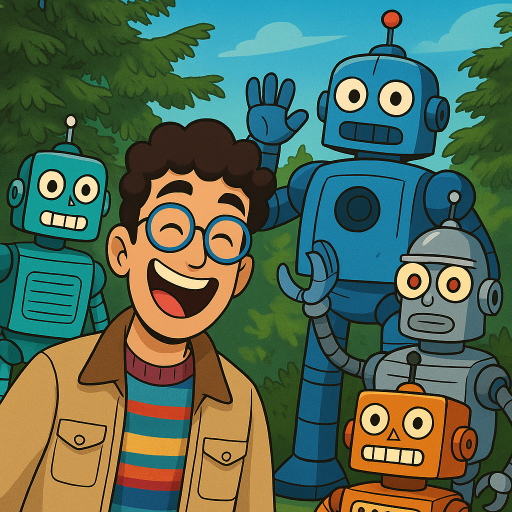

    <figure style="float: left; margin-right: 10px; width:15%;">
      
      <figcaption style="font-size: small; text-align: center;">Guess who's me</figcaption>
   </figure>
    

        <strong>Welcome to my personal website!</strong>
        

            <li>I am a Robotics Engineer in love with the field.</li>
            <li>I hold a M.Sc. in Autonomous Systems from the Technical University of Denmark.</li>
            <li>The code to some of my projects can be found <a href="https://github.com/ionymikler">here</a>.</li>
            <li>Here are my <a href="https://drive.google.com/drive/folders/1JZU4Mqzy72IL_R7KR-ndILqpjZupWLtq?usp=drive_link">CV</a> and my <a href="https://www.linkedin.com/in/jonathanmikler/">LinkedIn</a> profile</li>
        

    

This website is (**always**) a work in progress...
This place serves a double purpose.
1. As an archive of work I've done before, for now with the purpose of showing potential employers what I've done.
2. As a place to share some of the things I've learned and found interesting.

# Professional Background
Please check my [CV](https://drive.google.com/drive/folders/1JZU4Mqzy72IL_R7KR-ndILqpjZupWLtq?usp=drive_link) for a more detailed description of my professional background.

## Highlights 🌟
🌟 **Modular camera extrinsic calibration Tool** @[Robotize](https://robotize.com/)

   Developed for computing the precise pose of the camera sensors with respect to the mobile robot reference frame.

🌟 **Robotic software testing framework** @[AgriRobot](https://agrirobot.ai/)

   I helped develop a testing framework enabling ROS-based systems to test any subset of their architecture, from individual nodes to complete systems. This framework turned to be so effective that the company chose to open-source it. I’m currently working on the first public release.

🌟 **Speed Dependent Safety Zone Algorithm** @[AgriRobot](https://agrirobot.ai/)
   
   I implemented the prototype of a critical safety subsystem that dynamically calculates obstacle detection zones based on robot speed and size to ensure safe stopping distances.Built the initial prototype from theoretical modeling through to a 2D dynamic simulator, accounting for kinematic effects. The end results is the calculation of detection areas that allow the robot to operate safely.

🌟 **Autonomous Tractor project** @[Blue White Robotics](https://www.bluewhite.co/)

Took part in the core development as part of a 3-person team, building the first prototype for the autonomous tractor project. Implemented path-tracking, path-planning, and mission handling modules with basic hardware (depth camera, Arduino, GPS). The internal demo was succesful and managed to convince upper management, who were skeptical that the project could be done in-house, to shift from subcontractors to in-house development, scaling the team from 3 to 15 developers. The role involved extensive field testing to validate the system, which became the company's main product with original implementations still in production use today.

# Academics
1. Master Thesis: [Early Exit Networks for Computer Vision](courses/thesis/Study_of_Early_Exit_Neural_Networks_for_Computer_Vision.pdf)
2. Course: [Advanced Deep Learning for Computer Vision](https://kurser.dtu.dk/course/02501)

   Main project: Detection Transformer for Monocular 3D Object Detection. Check the poster [here](courses/adlcv/adlcv_poster.pdf). The code is available [here](https://github.com/esquivelrs/MonoDETR) and notes are [here](https://ludicrous-camel-09d.notion.site/MonoDETR-d3569c480d4e44159c68b9c1c27461ff)
      * Streamlined the learning of the depth-estimator, which led to better performance and lower variance during training.
      * Proposing use of *disentangled* losses to improve kearning (inspired by Cube R-CNN).
      * Replaced the visual encoder with a faster one from RT-DETR to explore real-time usage.
      * Reduced Backbone size to compare performance and speed.

   Other projects:
   1. Novel View Generation with NeRFs (my favourite)
   2. Visual Transformer for Image Classification
   3. Diffusion Models to Generate (guided and not-guided) 16x16 game sprites.

3. Course: [Artificial Intelligence for Multi-Agent Systems](https://kurser.dtu.dk/course/02285)
   
   Main Project: Windowed Hierarchichal Cooperative A* Multi-Agent Planning.[video](), [Code](https://github.com/ionymikler/MultiAgentPlanner)
      * Multi-agent planner using hierarchical time-window A* for cooperative pathfinding.
        * Uses a hierarchical task planner. A high-level planner assigns subgoals to agents and each agent solves its own pathfinding problem.
        * To solve conflicts, the planner uses a time-windowed approach; Agents involved in a plan conflict are allowed to replan their paths within a time frame.

4. Course: [Advanced Image Analysis Learning](https://kurser.dtu.dk/course/02506)
   
   Main Project: Probabilistic Deformable Models for Image Segmentation. [Poster](courses/adv_img_analysis/AdvImgAnalysis_Poster.pdf)
   
5. Course: [Perception for Autonomous Systems](https://kurser.dtu.dk/course/34759)
   
6. Course: [Logical Theories for Uncertainty and Planning](https://kurser.dtu.dk/course/02287)

   Main Project: Epistemic Logic for Reinforcement Learning. [Report](courses/logicalTheories/del-marl.pdf). The work was done together with [Elle McFarlane](https://github.com/ellemcfarlane) a great AI engineer if you need one.

# Blog Posts
1. [Early Exit Networks for Computer Vision - article](articles/thesis/ee-in-cv-pt1.html): My Master thesis summarized. How to make massive neural networks run 2.7x faster with barely any accuracy loss, why most production systems can't use it yet and how I bridged the gap a little between research and industry :-)
2. [Epistemic Planning in Multi-Agent Reinforcement Learning](courses/logicalTheories/del-marl.pdf). On the topic of Logic: I studied how epistemic logic could be used to help in the learning process of reinforcement learning agents. This was the final work of that class. 
3. [A Midsummer's Bayesian Dream](articles/bayesian/midSummer_Bayesian.md): Something cool I learned in a logical theories class (In progress...)

# Other projects
I develop on a need-to-have basis this `shell` toolbox:
1. Generic Shell Toolbox: [Shell Toolbox](https://github.com/ionymikler/generic_shell_toolbox)

